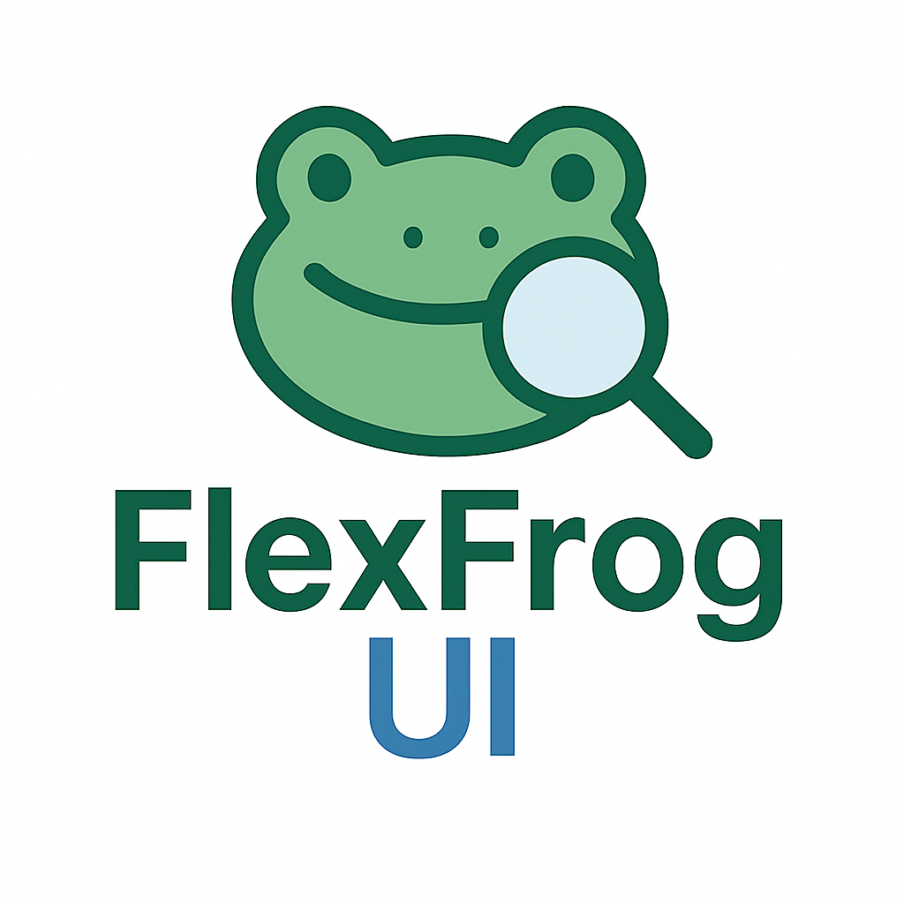

# FlexFrog UI



FlexFrog UI is a React-based web application that integrates with Telegram Web Apps to provide an intuitive interface for searching and managing images in Telegram chats using tags. 
The app supports image uploads, tag-based searches, and displays results in a responsive grid layout.

## Features

- **Telegram Web App Integration**: Expands and utilizes Telegram's WebApp API for seamless interaction.
- **Tag-Based Search**: Parse and search images using comma-separated tags.
- **Image Upload**: Upload images to enhance search results.
- **Responsive Design**: Built with Bootstrap for a mobile-friendly experience.
- **Customizable Theme**: Includes a custom theme for styling.

## Tech Stack

- **Frontend**: React, TypeScript
- **Styling**: Bootstrap, Custom CSS
- **Build Tool**: Vite
- **Package Manager**: npm

## Prerequisites

- Node.js (v18 or higher)
- npm (v8 or higher)
- Docker (optional, for containerized deployment)

## Installation

1. Clone the repository:
   ```bash
   git clone https://github.com/leet5/flexfrog-ui.git
   cd flexfrog-ui